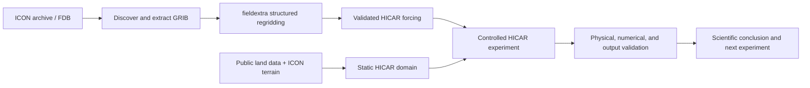

# ICON-to-HICAR Alpine downscaling

Research tools, experiments, and validated engineering foundations for dynamically downscaling
MeteoSwiss ICON output from roughly 1 km to 100--250 m with
[HICAR](https://github.com/HICAR-Model/HICAR) over Alpine domains.

> [!IMPORTANT]
> The project is in **scientific R&D / strategy-discovery mode**, not
> production qualification. The target application is 20 years of 100--200 m
> downscaling over Switzerland, initially focused on wind. Current work asks
> which downscaling method is scientifically defensible; existing workflow
> machinery is reusable infrastructure, not a required path or a commitment to
> the present implementation.
>
> [`AGENTS.md`](AGENTS.md) is the authoritative operating guidance;
> [`memory/project-assessment.md`](memory/project-assessment.md) contains the
> current scientific synthesis and next question.

Authorized MeteoSwiss Balfrin users can use the
[Balfrin quickstart](docs/balfrin-quickstart.md) when a costly experiment
benefits from the established, recoverable execution path. Small exploratory
analyses and cases may use narrower transparent setups while preserving
scientific validity, cluster safety, and enough provenance to interpret them.

## What this repository provides

The repository coordinates the complete downscaling chain while keeping the
large upstream models and generated data outside its own history:



It includes:

- ICON archive/FDB discovery and fieldextra conversion scripts;
- static-domain generation from public land data with boundary-topography
  relaxation;
- HICAR namelist rendering and Balfrin Slurm launchers;
- optional streaming forcing, restart, and ready-marker infrastructure;
- solver, geometry, physical-budget, observational, and output validators;
- reproducible Alpine, Switzerland 200 m, and planned Switzerland 100 m case
  studies;
- a pinned HICAR submodule and commit-locked optional fieldextra source
  reference.

Generated GRIB, NetCDF, restart, output, and log files are deliberately not
versioned. Small configuration files, manifests, checksums, scripts, and
validation reports are.

## Repository layout

| Path | Purpose |
| --- | --- |
| `scripts/` | Reusable source, forcing, static-domain, and wind-product tools |
| `case_studies/` | Self-contained domain configuration, Slurm stages, and validation |
| `tests/` | Coordinator regression and contract tests |
| `orchestration/` | Stateful pre-emptible campaign planning and reconciliation |
| `recovery/` | Source-protection and rebuild-critical artifact inventory |
| `HICAR/` | Pinned HICAR fork submodule |
| `externals/` | Locked metadata for optional external source references |
| `fieldextra/` | Optional private fieldextra checkout, ignored by the outer repository |
| `.agents/skills/` | Durable project procedures for source, forcing, domain, configuration, and runtime work |
| `memory/project-assessment.md` | Current synthesis, ranked goals, and next step |
| `docs/architecture.md` | Design boundaries, data lifecycle, and extension rules |
| `docs/disaster-recovery.md` | Deletion gate and clean-room rebuild procedure |

The case-study layout is intentionally preserved: operational scripts often
refer to their neighbouring configuration and validation files by relative
path. Reorganizing them into a Python package would obscure those execution
contracts and break reproducibility.

## Get started

Clone the coordinating repository and its pinned externals:

```bash
git clone --recurse-submodules \
  https://github.com/ofuhrer/icon_downscaling.git
cd icon_downscaling
./scripts/bootstrap_externals.sh
```

The default bootstrap initializes the public HICAR submodule. Developers with
access to the private COSMO-ORG fieldextra source can also create its locked
reference checkout:

```bash
./scripts/bootstrap_externals.sh --with-fieldextra
```

Create a local Python environment for validation and development:

```bash
python3 -m venv .venv
. .venv/bin/activate
python -m pip install --upgrade pip
python -m pip install -r requirements/dev.txt
make test
```

The full production workflow also needs NetCDF/NCO, ecCodes, GDAL, the
operational MeteoSwiss fieldextra installation, and a supported HICAR
toolchain. Balfrin module, partition, MPI, GPU, and Slurm conventions are
checked by `make balfrin-preflight` and documented in the
[Balfrin quickstart](docs/balfrin-quickstart.md); they are not reproduced by
the local Python environment.

## External source policy

HICAR and fieldextra remain independent projects with independent histories:

- `HICAR/` records the exact HICAR revision selected by the coordinator.
  The validated engineering branch is `feature/icon_downscaling`; qualified and failed
  scientific evidence branches remain separate and must not be selected by
  default. HICAR changes
  are developed, tested, committed, and pushed in that repository before the
  coordinating submodule pointer is advanced.
- `externals/fieldextra.lock` records the inspected private fieldextra source
  revision without making it a mandatory submodule of this public repository.
  Authorized developers may materialize it at `fieldextra/` with the bootstrap
  option above. Normal workflow runs use the verified operational executable;
  this project does not compile fieldextra unless that is explicitly
  requested.

Never replace a pinned submodule with a copied source tree. To inspect the
current pins:

```bash
git submodule status
git -C HICAR rev-parse HEAD
sed -n '1,80p' externals/fieldextra.lock
```

## Data and reproducibility

Large inputs and products belong in campaign scratch storage, normally below
`$SCRATCH/icon_hicar` on Balfrin. An interpretable R&D result normally retains:

- source commit and executed case;
- the relevant configuration and input differences;
- the key outputs or compact derived evidence;
- checksums or ready markers only where exact identity or concurrent use makes
  them material.

Production releases will require stronger provenance, archival, validation,
and recovery contracts after the scientific strategy converges. Do not rerun
a scientifically valid experiment merely to repair bookkeeping or packaging
that cannot affect its interpretation.

Do not commit credentials, access tokens, archive payloads, local build trees,
or model data. See [the architecture guide](docs/architecture.md) for the
boundary between source-controlled evidence and external campaign data.

Before deleting a workstation checkout or `$SCRATCH/icon_hicar`, follow the
[disaster-recovery guide](docs/disaster-recovery.md) and run:

```bash
make recovery-audit
```

This is a conservative deletion gate, not merely a source-code check. It
requires protected external changes and an approved durable archive contract.
The compact recovery foundation in
`/store_new/mch/msopr/olifu/icon_downscaling/recovery/v1` can be checked
independently on Balfrin with `make recovery-archive-verify`; it does not by
itself authorize an annual production campaign.

## Development

Run the coordinator tests with:

```bash
make test
```

This portable suite is required to pass against the pinned, reachable HICAR
submodule. Its compression test requires `nccopy` from the NetCDF command-line
tools (`netcdf-bin` on Debian and Ubuntu).

Two source-coupled test files describe the union of newer HICAR metadata,
wind-output, water-budget, and restart contracts under active development.
Run them only when integrating the corresponding HICAR source lines:

```bash
make test-hicar-contract
make test-all
```

They are intentionally not part of public coordinator CI. The current
experimental baseline is HICAR `5d557495`; it includes the corrected wind
tendency, restart state, water-budget diagnostics, initialization-only path,
and sparse LBC reader. A local dirty HICAR tree must never be smuggled into the
outer repository through passing tests.

Run the repository-level syntax and whitespace checks with:

```bash
make check
```

Before changing an operational path, read `AGENTS.md`,
`memory/project-assessment.md`, and the smallest matching project skill. See
[`CONTRIBUTING.md`](CONTRIBUTING.md) for change ownership and validation
expectations.

## License

No repository-wide license has been selected yet. HICAR and fieldextra retain
the licenses in their respective repositories. Choose and add a license before
redistributing or accepting external contributions to the coordinating code.
