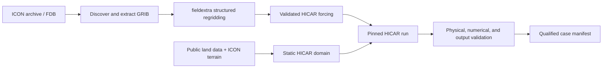

# ICON-to-HICAR Alpine downscaling

Reproducible tools and qualified case studies for dynamically downscaling
MeteoSwiss ICON output from roughly 1 km to 100--250 m with
[HICAR](https://github.com/HICAR-Model/HICAR) over Alpine domains.

> [!IMPORTANT]
> This is a research and qualification workflow, not an operational forecast
> service. The Switzerland-wide 200 m workflow is the current engineering
> baseline; scientific and long-duration promotion gates are still active.
> The 100 m workflow remains conditional on its capacity and physical-quality
> gates.

## What this repository provides

The repository coordinates the complete downscaling chain while keeping the
large upstream models and generated data outside its own history:



It includes:

- ICON archive/FDB discovery and fieldextra conversion scripts;
- static-domain generation from public land data with boundary-topography
  relaxation;
- HICAR namelist rendering and Balfrin Slurm launchers;
- streaming forcing, restart, and ready-marker publication contracts;
- solver, geometry, physical-budget, observational, and output validators;
- reproducible Alpine, Switzerland 200 m, and planned Switzerland 100 m case
  studies;
- a pinned HICAR submodule and commit-locked optional fieldextra source
  reference.

Generated GRIB, NetCDF, restart, output, and log files are deliberately not
versioned. Small configuration files, manifests, checksums, scripts, and
validation reports are.

## Repository layout

| Path | Purpose |
| --- | --- |
| `scripts/` | Reusable source, forcing, static-domain, and wind-product tools |
| `case_studies/` | Self-contained domain configuration, Slurm stages, and validation |
| `tests/` | Coordinator regression and contract tests |
| `validation/` | Small cross-case runtime probes and rank-layout helpers |
| `orchestration/` | Reserved design boundary for future stateful campaign control |
| `HICAR/` | Pinned HICAR fork submodule |
| `externals/` | Locked metadata for optional external source references |
| `fieldextra/` | Optional private fieldextra checkout, ignored by the outer repository |
| `.agents/skills/` | Durable project procedures for source, forcing, domain, configuration, and runtime work |
| `memory/project-state.md` | Current validated milestones, blockers, and canonical artifacts |
| `docs/architecture.md` | Design boundaries, data lifecycle, and extension rules |

The case-study layout is intentionally preserved: operational scripts often
refer to their neighbouring configuration and validation files by relative
path. Reorganizing them into a Python package would obscure those execution
contracts and break reproducibility.

## Get started

Clone the coordinating repository and its pinned externals:

```bash
git clone --recurse-submodules \
  https://github.com/ofuhrer/icon_downscaling.git
cd icon_downscaling
./scripts/bootstrap_externals.sh
```

The default bootstrap initializes the public HICAR submodule. Developers with
access to the private COSMO-ORG fieldextra source can also create its locked
reference checkout:

```bash
./scripts/bootstrap_externals.sh --with-fieldextra
```

Create a local Python environment for validation and development:

```bash
python3 -m venv .venv
. .venv/bin/activate
python -m pip install --upgrade pip
python -m pip install -r requirements/dev.txt
make test
```

The full production workflow also needs NetCDF/NCO, ecCodes, GDAL, the
operational MeteoSwiss fieldextra installation, and a supported HICAR
toolchain. Balfrin module, partition, MPI, GPU, and Slurm conventions are
documented in the project skills and case launchers; they are not reproduced
by the local Python environment.

## Follow the workflow

1. **Choose a domain.** Start with
   [`case_studies/swiss_200m/README.md`](case_studies/swiss_200m/README.md)
   for the national engineering baseline or
   [`case_studies/swiss_100m/README.md`](case_studies/swiss_100m/README.md)
   for the gated high-resolution plan.
2. **Discover source data.** Use the case extraction scripts and the
   `icon-balfrin-grib` procedure to resolve cycles, steps, geometry, and
   message counts.
3. **Build structured forcing.** The main reusable entry point is
   [`scripts/prepare_icon_inputs.sh`](scripts/prepare_icon_inputs.sh).
   Case-specific REA-L streaming stages live beside their case.
4. **Build the static domain.** Use
   [`scripts/prepare_static_inputs.py`](scripts/prepare_static_inputs.py)
   directly or a case `prepare_static_domain.sh` wrapper.
5. **Render and run HICAR.** Render only after the static and forcing products
   have passed validation and acquired ready markers. Run a small
   representative case before increasing duration, area, resolution, or node
   count.
6. **Validate before promotion.** Numerical convergence, geometry, source
   identity, output schema, physical budgets, restart continuity, and
   observational comparisons are independent gates. A fast or technically
   complete run is not by itself a scientifically qualified run.

Ready markers are publication guarantees: write to a temporary path, validate
the finished product, atomically rename it, and create `<file>.ready` last.

Current long Slurm chains use fixed run directories and do not yet implement
requeue/signal recovery or a stateful retry lease. They must not be described
as pre-emption-safe. The future controller boundary and its non-goals are
documented in [`orchestration/README.md`](orchestration/README.md).

## External source policy

HICAR and fieldextra remain independent projects with independent histories:

- `HICAR/` pins the exact fork revision used by this workflow. HICAR changes
  are developed, tested, committed, and pushed in that repository before the
  coordinating submodule pointer is advanced.
- `externals/fieldextra.lock` records the inspected private fieldextra source
  revision without making it a mandatory submodule of this public repository.
  Authorized developers may materialize it at `fieldextra/` with the bootstrap
  option above. Normal workflow runs use the verified operational executable;
  this project does not compile fieldextra unless that is explicitly
  requested.

Never replace a pinned submodule with a copied source tree. To inspect the
current pins:

```bash
git submodule status
git -C HICAR rev-parse HEAD
sed -n '1,80p' externals/fieldextra.lock
```

## Data and reproducibility

Large inputs and products belong in campaign scratch storage, normally below
`$SCRATCH/icon_hicar` on Balfrin. Every publishable case should retain:

- exact source paths, cycles, steps, and field selections;
- external source commits and executable checksums;
- domain and forcing configuration;
- checksums for immutable inputs and outputs;
- validation results and acceptance thresholds;
- an atomic ready marker only after successful validation.

Do not commit credentials, access tokens, archive payloads, local build trees,
or model data. See [the architecture guide](docs/architecture.md) for the
boundary between source-controlled evidence and external campaign data.

## Development

Run the coordinator tests with:

```bash
make test
```

This portable suite is required to pass against the pinned, reachable HICAR
submodule. Its compression test requires `nccopy` from the NetCDF command-line
tools (`netcdf-bin` on Debian and Ubuntu).

Two source-coupled test files describe newer HICAR metadata and restart
contracts under active development; run them only against the matching HICAR
candidate worktree:

```bash
make test-hicar-contract
make test-all
```

They are intentionally not part of public coordinator CI until the matching
HICAR implementation is committed, pushed, and qualified. A local dirty HICAR
tree must never be smuggled into the outer repository through passing tests.

Run the repository-level syntax and whitespace checks with:

```bash
make check
```

Before changing an operational path, read `AGENTS.md`,
`memory/project-state.md`, and the smallest matching project skill. See
[`CONTRIBUTING.md`](CONTRIBUTING.md) for change ownership and validation
expectations.

## License

No repository-wide license has been selected yet. HICAR and fieldextra retain
the licenses in their respective repositories. Choose and add a license before
redistributing or accepting external contributions to the coordinating code.
