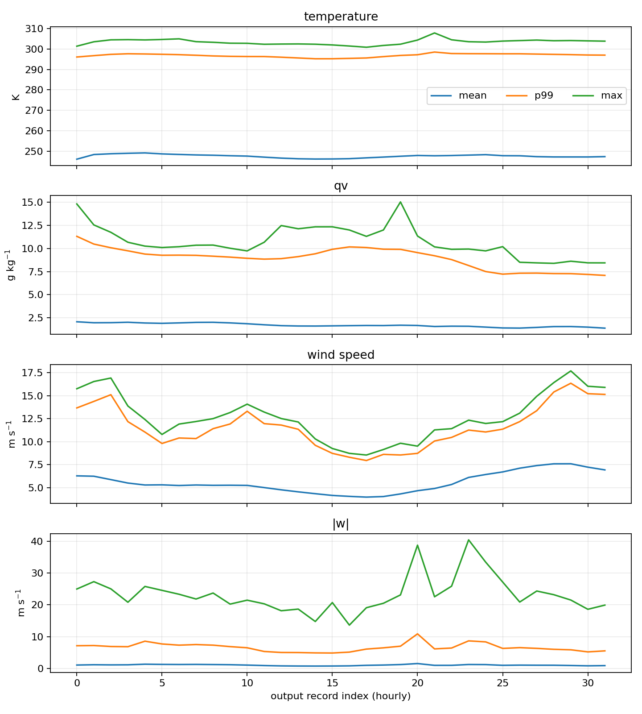
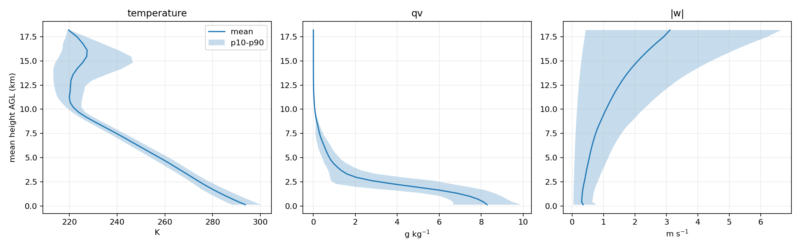
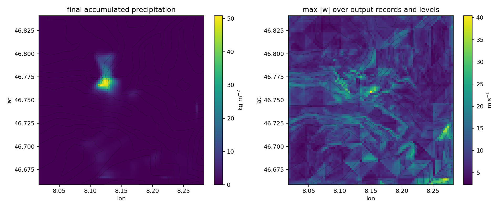
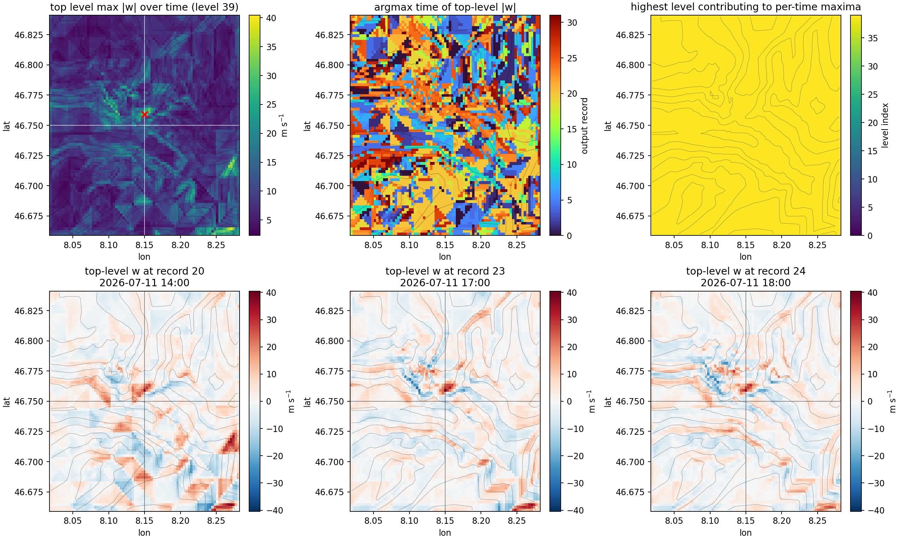
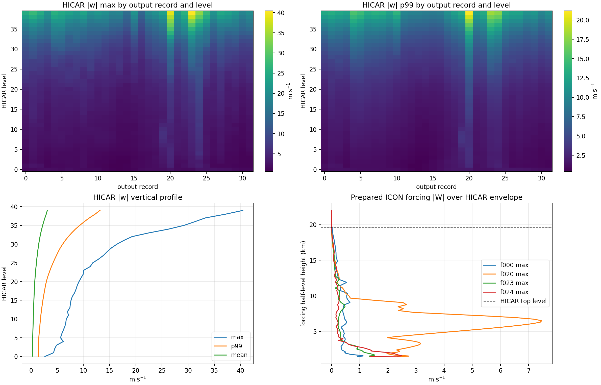

# HICAR Output Physicality Analysis

Output files analyzed: `2`
- `domain_static_relaxed_2026-07-10_18-00-00.nc`
- `domain_static_relaxed_2026-07-11_18-00-00.nc`
Output records: `32` from `2026-07-10 18:00:00` to `2026-07-12 01:00:00`

## Executive Summary

- All analyzed output fields are finite; no NaN or Inf values were found.
- Temperature, humidity, and horizontal wind ranges are within the already-validated ICON forcing envelope and are physically plausible for an Alpine summer case.
- Precipitation behaves like an accumulated field: it is non-decreasing except for negligible roundoff noise, with a localized maximum near 50.9 kg m-2.
- Vertical velocity is the main caution: global extrema reach roughly +40/-31 m s-1. Follow-up diagnostics show the suspicious max-`|w|` map is dominated everywhere by the highest HICAR output level, not by near-surface terrain-following vertical motion.
- The run used a deliberately minimal physics suite and aborted near the end because HICAR required one more forcing file beyond the requested end time; this output is useful for engineering/physicality screening, not yet for production science.

## Coverage And Integrity

- File count: `2`
- Time records: `32` hourly records.
- Time range: `2026-07-10 18:00:00` to `2026-07-12 01:00:00`.
- Expected full 33 h run did not finish cleanly; records stop before the requested final time because the model aborted on forcing-list end handling.
- `temperature` finite values: `8398080/8398080`.
- `qv` finite values: `8398080/8398080`.
- `u` finite values: `8501760/8501760`.
- `v` finite values: `8501760/8501760`.
- `w` finite values: `8398080/8398080`.
- `precipitation` finite values: `209952/209952`.
- `z` finite values: `262440/262440`.

## Global Ranges

| Field | Units | Min | P01 | Median | P99 | Max | Mean |
|---|---:|---:|---:|---:|---:|---:|---:|
| `temperature` | K | 206.816 | 212.738 | 244.222 | 296.872 | 307.782 | 247.663 |
| `qv` | kg kg-1 | 2.54454e-06 | 2.61679e-06 | 0.00031719 | 0.00947385 | 0.0150473 | 0.00170171 |
| `u` | m s-1 | -8.14968 | -5.74297 | 2.29889 | 11.568 | 15.7489 | 2.75896 |
| `v` | m s-1 | -12.9791 | -9.68444 | -2.71747 | 6.27407 | 12.8818 | -2.65678 |
| `w` | m s-1 | -30.9197 | -5.00594 | 0.00285047 | 5.65453 | 40.4312 | 0.0408018 |
| `precipitation` | kg m-2 | -1.06898e-13 | 0 | 0 | 4.52693 | 50.9002 | 0.230345 |
| `z` | m | 667.473 | 1283.96 | 8562.33 | 19645.3 | 19668.3 | 9269.78 |

## Comparison To Prepared ICON Forcing

| Quantity | HICAR output range | Prepared forcing range | Assessment |
|---|---:|---:|---|
| `temperature` / `T` | 206.816 .. 307.782 | 202.07 .. 310.753 | inside forcing envelope |
| `qv` / `QV` | 2.54454e-06 .. 0.0150473 | 3.7536e-07 .. 0.0173459 | inside forcing envelope |
| `u` / `U` | -8.14968 .. 15.7489 | -25.2953 .. 36.1868 | inside forcing envelope |
| `v` / `V` | -12.9791 .. 12.8818 | -32.757 .. 29.8248 | inside forcing envelope |
| `w` / `W` | -30.9197 .. 40.4312 | -14.6305 .. 56.9271 | outside forcing envelope |

Note: `w` is not expected to remain strictly inside the coarse forcing `W` range because HICAR recomputes flow over higher-resolution relaxed topography. The output minimum being more negative than the prepared forcing minimum is therefore a diagnostic flag, not by itself a conservation or file-read failure.

## Vertical Grid And Terrain

- Static topography range used by HICAR: `521.047 .. 2634.763 m`.
- First model-level AGL height range: `142.762 .. 146.425 m`.
- Top model-level AGL height range: `17033.559 .. 19100.013 m`.
- Minimum vertical spacing between output levels: `282.635 m`; vertical coordinate is monotonic everywhere: `True`.
- Boundary-zone topography relaxation is present in the static file and was used by this run.

## Field-Specific Checks

### Temperature

- Full range: `206.816 .. 307.782 K`.
- Near-surface output level range: `280.914 .. 307.782 K`.
- Top output level range: `218.495 .. 221.526 K`.
- No cold-collapse signature like the earlier theta-advection failure is visible in the output range.

### Humidity

- Specific humidity range: `2.54454e-06 .. 0.0150473 kg kg-1`.
- Negative humidity count: `0`.
- The maximum corresponds to about `15 g kg-1`, plausible near the lower troposphere in July.

### Horizontal And Vertical Wind

- Mass-grid horizontal wind-speed range: `0.001 .. 17.710 m s-1`; p99 is `13.702 m s-1`.
- |w| percentiles: p50=`0.560`, p90=`2.500`, p99=`6.742`, p99.9=`12.342`, max=`40.431` m s-1.
- Fraction of `|w| > 5 m s-1`: `2.37854%`.
- Fraction of `|w| > 10 m s-1`: `0.24452%`.
- Fraction of `|w| > 20 m s-1`: `0.00857%`.
- Fraction of `|w| > 30 m s-1`: `0.00044%`.
- Strongest `|w|` levels by max value:
  - level `39`: max `40.431 m s-1`, p99 `13.159 m s-1`.
  - level `38`: max `37.128 m s-1`, p99 `12.233 m s-1`.
  - level `37`: max `33.286 m s-1`, p99 `11.133 m s-1`.
  - level `36`: max `31.284 m s-1`, p99 `10.183 m s-1`.
  - level `35`: max `29.181 m s-1`, p99 `9.295 m s-1`.
- Share of `|w| > 10 m s-1` points on the outermost grid-cell edge: `12.99%`.
- Share of `|w| > 20 m s-1` points on the outermost grid-cell edge: `15.14%`.
- Share of `|w| > 30 m s-1` points on the outermost grid-cell edge: `8.11%`.
- Max `w` at record `23`, level `39`, lat/lon `46.75900, 8.15000`: `40.431 m s-1`.
- Min `w` at record `23`, level `39`, lat/lon `46.76124, 8.11073`: `-30.920 m s-1`.
- Targeted diagnostics in `w_pathology_report.md` found that the cell-wise max over all records and levels comes from level `39` for all `6561/6561` horizontal cells. Prepared ICON forcing `W` is near zero at the closest forcing half level to the mean HICAR top height during records `20`, `23`, and `24`, so the largest values are not a direct passthrough of top-boundary ICON `W`.
- Interpretation: the domain is numerically stable through the available run, but the local vertical-velocity extremes are physically aggressive and top-level dominated. The next diagnostic run should output both NetCDF `w` (HICAR `w_real`) and `w_grid` (HICAR grid-relative internal vertical velocity), and should test sensitivity to model-top/upper-boundary treatment.

### Precipitation

- Accumulated precipitation range over available records: `-1.06898e-13 .. 50.9002 kg m-2`.
- Final accumulated precipitation: mean `0.588`, p99 `16.308`, max `50.900 kg m-2`.
- Hourly increment range: `-1.02176e-13 .. 34.7052 kg m-2 h-1`.
- Negative hourly increments below `-1e-5`: `0`.
- The tiny negative global minimum is numerical roundoff around zero, not a physically meaningful negative precipitation amount.

## Figures

## Scientific Plausibility Verdict

The available output is numerically well behaved and physically plausible at first order: no NaNs/Infs, no humidity negativity, no temperature collapse, reasonable horizontal winds, monotonic vertical coordinate, and monotonic accumulated precipitation. The main scientific caution is top-level dominated extreme vertical velocity. Given the minimal physics configuration (`mp = morrison`, but no PBL, LSM, surface, radiation, or water physics), the incomplete run termination, and the unresolved upper-level `w` behavior, this should be treated as a successful engineering smoke/physicality screen, not yet a production-quality downscaling experiment.
