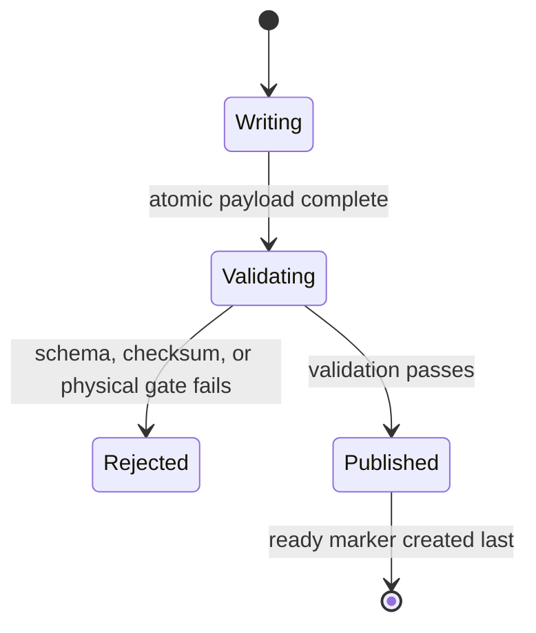

# Project architecture

## Design goals

The coordinating repository must make a scientifically qualified run
reproducible without turning Git into a data archive or merging independent
upstream projects into one history. The design therefore separates:

1. reusable workflow logic;
2. case-specific execution contracts;
3. independently versioned external source;
4. small, reviewable qualification evidence; and
5. large campaign data stored outside Git.

The current paths are stable interfaces. Many Slurm jobs, manifests, and
validators resolve neighbouring files relative to their own case directory,
so architectural improvement is additive rather than a bulk move.

## Components and ownership

### Reusable coordinator tools

`scripts/` contains source-independent tools that are useful to more than one
case: ICON-to-structured conversion, public static-data preparation, SLEVE
validation, and derived wind products. A script belongs here when its inputs
are explicit and it does not embed one case's acceptance decision.

`validation/` contains small cross-case runtime probes and launcher
configuration. Python validators that implement a case's scientific contract
stay with that case.

`orchestration/` contains the primary stateful retry/lease controller for the
short-slice pre-emptible workflow. It owns attempt identity, scheduler
reconciliation, capacity limits, and final coverage publication. It does not
absorb scientific validators, case Slurm scripts, or model logic. Legacy
long-running DAGs still have no requeue/signal recovery and remain outside
this pre-emption-safe path.

### Case studies

Each directory below `case_studies/` is an independently reviewable
experiment or production candidate. New maintained cases should prefer:

```text
case_studies/<case>/
├── README.md
├── config/       # domain, namelist templates, frozen acceptance plans
├── scripts/      # extraction, preparation, launch, and publication stages
├── streaming/    # chunk/restart logic when the case is streamed
└── validation/   # validators and small JSON evidence
```

Static, forcing, restart, output, and log directories may exist locally but
their large products are ignored. Commit a manifest or checksum rather than
the corresponding NetCDF or GRIB payload.

Historical one-off experiments may retain their existing layout when moving
them would invalidate documented paths. New production logic should not be
added to a retired experiment directory.

### External source

HICAR and fieldextra use different external-source mechanisms because their
access models differ.

- The HICAR pointer is an executable scientific dependency. Advance it only
  after its commit is pushed and the coordinator regression case passes.
- `externals/fieldextra.lock` documents the inspected revision of the private
  source repository. It may be materialized as an ignored `fieldextra/`
  checkout by an authorized developer. Public clones and CI do not require
  access. Operational conversion continues to use the separately managed,
  verified executable.

An outer commit must never be the only place from which an external source
change can be recovered. Commit and push the nested repository first, then
advance the outer gitlink in a separate, reviewable change.

### Procedures and mutable state

`AGENTS.md` routes maintainers and automated collaborators to the correct
procedure. `.agents/skills/` records durable schemas, invariants, and cluster
procedures. `memory/project-state.md` records only current milestones,
validated artifacts, blockers, and next gates.

Do not add chronological command diaries. Reusable knowledge belongs in a
skill; mutable project status belongs in project state; reproducible run
details belong in a case manifest.

## Data lifecycle

Every published forcing, static, restart, or output product follows the same
state transition:



A ready marker without a complete and validated payload is a workflow defect.
Consumers may treat a ready marker as a publication guarantee and therefore
must not implement compensating guesses.

## Dependency direction

The intended dependency direction is:

```text
external source/data
        ↓
reusable scripts
        ↓
case configuration and launchers
        ↓
case validators
        ↓
small qualification manifests
```

Reusable scripts must not import case validators. Case code may call reusable
scripts. Tests may inspect every layer. HICAR and fieldextra must not depend on
this coordinating repository.

## Source-controlled versus external artifacts

Commit:

- scripts, templates, Slurm files, and tests;
- domain and experiment configuration;
- schemas, acceptance thresholds, and small manifests;
- compact JSON/text validation evidence;
- documentation and exact external gitlinks.

Keep outside Git:

- GRIB, NetCDF, Zarr, restart, and raw model output;
- build directories and compiler modules;
- downloaded public-data caches;
- scheduler stdout/stderr and transient work directories;
- local virtual environments and code-index caches;
- archived repository bundles and retired source clones.

If a small binary artifact is essential to a regression test, document why it
cannot be generated and choose an explicit artifact-storage policy before
adding it. Do not silently weaken the ignore rules.

## Adding a new case

1. Copy structure, not results, from the closest maintained case.
2. Make the domain and driving-data coverage explicit.
3. Freeze input, output, restart, resource, and acceptance contracts in
   configuration.
4. Validate a small representative run before scaling.
5. Record exact external commits and executable checksums.
6. Add focused tests for publication, restart, and promotion logic.
7. Link the case from the top-level README only after its entry path is
   reproducible.

## Repository bootstrap and CI

`scripts/bootstrap_externals.sh` initializes only clean external worktrees at
the pinned commits and refuses to disturb local nested changes. Its default
path initializes public HICAR. The explicit `--with-fieldextra` option
materializes the locked private source reference when the caller has access.

The lightweight repository checks deliberately stop short of compiling HICAR
or fieldextra. Coordinator CI checks Python syntax, shell syntax, whitespace,
and the portable Python coordinator suite against the pinned reachable HICAR
commit. Source-coupled tests for active HICAR metadata/restart development are
an explicit `make test-hicar-contract` gate and do not enter public CI before
the matching HICAR implementation is committed, pushed, and qualified. HICAR
build, MPI, GPU, and physical regression gates remain target-stack workflows
documented by the case and runtime procedures.

## Pre-emptible orchestration boundary

The implemented controller coordinates short campaign segments with:

- durable segment identity and immutable attempt identity;
- exclusive leases with expiry and ownership checks outside the Slurm job;
- bounded sequential execution within one chain and capacity-aware
  concurrency across independent chains;
- reconciliation of scheduler state with published artifacts;
- retry classification that distinguishes infrastructure pre-emption from
  deterministic model or scientific failure;
- restart selection from validator-published, checksum-bound checkpoints;
- idempotent publication recovery across termination at every boundary;
- unlimited retries for explicitly recognized scheduler interruptions, while
  deterministic model, validation, timeout, and resource failures enter an
  explicit terminal blocked state.

Slurm requeue is not itself resume. The controller never reuses a partial
attempt directory, weakens a scientific gate, or infers success from scheduler
completion alone. A missing ready marker may be recovered only by revalidating
the complete payload and its hashes. Otherwise the incomplete artifact is
quarantined and work is repeated.

On Balfrin, `preemptible` currently uses cancellation pre-emption with
`SIGTERM` and a 60-second grace period, while `lowprio` has priority zero and
pre-emption disabled. Global `JobRequeue=1` is not a recovery protocol. A
signal path must not exit successfully unless a segment-completion marker has
already been published, or an `afterok` dependency could release an incomplete
successor. Signal-driven safe-stop is best effort only: restart payloads are
roughly 42 GB at 200 m and about four times larger at 100 m. Hard-kill recovery
must select the last already-closed, validator-published checkpoint.

Heavy HICAR attempts are the only jobs initially assigned to `preemptible`.
The lightweight persistent watcher uses `pp-long`; one campaign-wide CPU
array uses `pp-short` with a maximum of two active tasks. The model-slot limit
is node-aware against a 44-node budget and may be changed at runtime, including
zero to pause submissions. The controller keeps work pending up to that limit;
Slurm itself notices freed nodes and starts the queued attempts immediately,
so no separate free-node polling policy or fixed retry delay is required.
Parallelism is allowed only across independently authorized restart chains.

The controller now journals and resumes forcing, restart, failed-attempt, and
raw-output retirement after compression and validation publications pass.
It preserves configured periodic and final checkpoints and caps each chain's
unretired backlog. Durable transfer remains a separate archive-contract
decision; scratch retirement is never evidence of durable publication.

## Supported Balfrin entry point

`config/balfrin.env` is the single non-secret site-default record used by the
primary shell wrappers and onboarding preflight. The wrappers source
`scripts/load_balfrin_site_config.sh` before module initialization, preserving
explicit environment overrides. The record names the module tree,
REA-L FDB image, fieldextra assets, ICON grid, `/store_new` durable root,
production HICAR branch/pin, and primary workflow. Environment overrides are
explicit and are recorded in preflight or campaign evidence.

`docs/balfrin-quickstart.md` is the operator entry point. It moves a clean
checkout through:

1. site and dependency preflight;
2. checksum-bound restoration of rebuild-critical static input;
3. canonical HICAR build publication;
4. immutable runtime and release-specific Python publication;
5. a bounded two-hour, one-chain campaign definition; and
6. dry reconciliation before any Slurm submission.

The quickstart cannot construct a production authorization. Scientific and
long-duration promotion remain fail-closed even when all engineering
onboarding checks pass.
