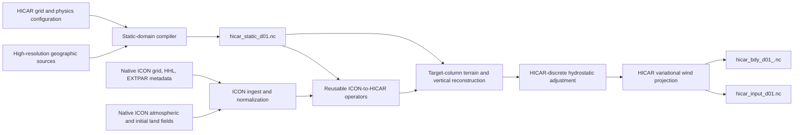

# ICON-to-HICAR meteorological preprocessing design

## Implemented foundation (2026-08)

The first greenfield implementation now lives under `preprocessing/hicarprep`
with the entry point `scripts/hicarprep.py`. It implements the lifetime-aware
domain compiler, HICAR SLEVE HHL/HFL generation, cached Gaussian RBF kernel
solves, native normal-wind vector RBF reconstruction, terrain-aware column
transformation, generalized-RH `QV/QC` reconstruction, condensate-aware
hydrostatic pressure integration, terrain/top W adjustment, identical IC/LBC
state construction, sparse physical-distance boundary extraction, provenance,
valid-time surface/external assembly, selectable SMI, relative-saturation, and
absolute-`W_SO` soil-water policies, joint all-water conversion to
HICAR's dry-air basis, ordered boundary-sequence validation, and strict
analytic/contract tests.

The operational land-state path now also decodes native REA-L GRIB plus its
matching tuned EXTPAR under strict time/unit/level/grid contracts, applies
target-layer Noah-MP hydraulics and explicit glacier/water policies, and merges
the selected valid-time state into the exact domain variables HICAR reads.
Static generation reclassifies source pixels before land-cover fraction
aggregation, overlap-aggregates soil texture to all four physics layers, and
labels epoch/monthly/time-series lifetimes explicitly.

The field-lifetime contract is a material part of the implementation. Runtime
input is split into immutable geometry, epoch fields, cyclic climatologies,
continuous external time series, and initial-only prognostic surface state.
Thus land cover or glacier state can change by epoch, LAI/albedo can follow a
cycle, SST/lake state can evolve continuously, and soil/snow state remains an
initial condition instead of being mislabeled as static.

Model-ready integration gates remain explicit. HICAR's pressure-adjustment
path, exact mass/U/V/interface staggering, and variational wind projection are
not duplicated in Python, and the HICAR reader does not yet bracket the new
sparse LBC records. Both IC and LBC writers therefore refuse normal
publication. A marked continuously hydrostatic research output exists for
tests, but cannot be mistaken for a model-ready IC.
Operational GRIB decoding likewise remains a source-adapter concern; the
implemented core consumes a strict canonical native-grid ICON NetCDF
representation.

## Decision

Build a new model-aware preprocessor, referred to here as `hicarprep`, that
directly transforms native-grid ICON output into complete HICAR-native initial
and lateral-boundary states on the final 100--200 m grid.

This is a replacement design. It is not constrained by the current
fieldextra-to-structured-NetCDF path, HICAR's present forcing reader, its
runtime horizontal/vertical interpolation, or the current full-domain forcing
contract. Those components identify what must be replaced; they do not define
the new interface.

The preprocessor should adopt the common architecture found in WPS/WRF,
int2lm/COSMO, and ICON:

1. compile authoritative target-grid static data separately;
2. normalize native source fields and horizontal-grid/vector semantics;
3. horizontally remap source profiles and their geometry to the exact target
   locations;
4. reconstruct the atmosphere on the target terrain-following vertical grid;
5. enforce target-model hydrostatic and wind balance;
6. write one complete initial condition and target-native lateral-boundary
   snapshots produced by the same transformation.

Soil-moisture conservation is explicitly not a design or acceptance
requirement. Soil state must be finite, bounded, mask-consistent, and useful as
an initial condition, but it need not preserve the ICON column integral.

## Scope and evidence

Three independent documentation-first and source-second reviews were made:

- WPS 4-era sources plus WRF `real.exe` under `tmp/WPS` and `tmp/WRF`;
- int2lm commit `f1260b3eeaaf` plus EXTPAR commit `6136cf97c79e` under
  `tmp/int2lm` and `tmp/extpar`;
- COSMO User Guide 5.04 at
  `tmp/cosmo/cosmo/DOCS/cosmo_userguide_5.04.pdf` and model source under
  `tmp/cosmo/cosmo/src`;
- ICON commit `582ee671c78f` plus the same EXTPAR source under `tmp/icon-nwp`
  and `tmp/extpar`.

One evidence limitation matters:

- ICON's `ifs2icon` wrapper invokes an external `iconremap_mpi` executable
  whose implementation is not in the ICON checkout, so its detailed RBF and
  vector-remap implementation could not be audited.

This does not change the cross-system architectural conclusion because int2lm,
COSMO, ICON's target-coordinate initialization, and WRF `real.exe` provide
independent source-level comparisons.

## What the three systems actually do

### WPS and WRF

The documented workflow separates source decoding and horizontal remapping
from model-state construction:

- `geogrid.exe` defines the target horizontal domain and static fields;
- `ungrib.exe` decodes source GRIB through a source-specific field table;
- `metgrid.exe` performs field-specific horizontal remapping;
- WRF `real.exe` constructs the target vertical coordinate, interpolates
  vertically, adjusts for target terrain, builds a hydrostatically consistent
  state, and writes IC/LBC products.

Documentation evidence is in `tmp/WPS/README:18-47`. The implementation makes
the separation concrete:

- `tmp/WPS/metgrid/METGRID.TBL.ARW:114-162,602-727` assigns different
  interpolation, masking, and staggering rules to different fields;
- `tmp/WPS/metgrid/src/process_domain_module.F:1222-1265` chooses mass, U, or V
  target coordinates before interpolation;
- `tmp/WPS/metgrid/src/process_domain_module.F:798-827,1388-1465` converts
  winds between source-grid, earth-relative, and target-grid bases;
- `tmp/WPS/metgrid/METGRID.TBL.ARW:204-275` remaps soil moisture only over
  land with weighted/search fallbacks; WRF subsequently converts layer water
  units where required and applies target-LSM-specific validity checks in
  `tmp/WRF/dyn_em/module_initialize_real.F:937-960,3239-3310`. This is useful
  masked-interpolation precedent, but does not establish absolute VWC as an
  invariant across a change in soil hydraulic class;
- `tmp/WRF/dyn_em/module_initialize_real.F:1355-2690` uses both source and
  target terrain, constructs the target coordinate, and performs field-specific
  vertical interpolation;
- `tmp/WRF/dyn_em/module_initialize_real.F:3641-4225` iteratively constructs a
  hydrostatically consistent target state;
- `tmp/WRF/main/real_em.F:832-1052` and
  `tmp/WRF/share/module_bc.F:3652-3695` derive boundary states and tendencies
  only after target-coordinate state construction.

The useful lesson is the WPS/`real.exe` division of concerns, not WPS's legacy
file stages. `hicarprep` should provide one end-to-end application while
retaining internal modules for source decoding, field policy, horizontal
mapping, target-coordinate reconstruction, and state encoding.

### int2lm and EXTPAR

int2lm is the closest analogue because it directly supports native ICON input
and target SLEVE geometry. Its top-level sequence in
`tmp/int2lm/src/int2lm_org.f90:277-430` is horizontal interpolation, vertical
transformation, surface/soil construction, and IC or boundary output.

Important implementation choices are:

- `tmp/int2lm/src/setup_int2lm.f90:702-930` loads the native ICON grid, checks
  coverage, and precomputes ICON-to-target relations;
- `tmp/int2lm/src/icon_interp_utilities.f90:1611-1765` constructs and solves the
  ten-cell donor-kernel system, then normalizes it to preserve constants;
- `tmp/int2lm/src/icon_interp_utilities.f90:760-980` constructs the nine-edge
  vector kernel, including Cartesian normal dot products and separate
  geographic-component right-hand sides;
- `tmp/int2lm/src/icon_interp_utilities.f90:2350-2455` scales the Gaussian
  kernel with source-grid spacing;
- `tmp/int2lm/src/icon_interp_utilities.f90:2175-2228` optionally bounds the
  result by the source-stencil extrema;
- `tmp/int2lm/src/src_icon_interpol.f90:2370-2405` never uses direct absolute
  VWC for ICON-to-COSMO soil transfer: with `l_smi` it interpolates
  `max((theta-PWP)/(FC-PWP),0)`, and otherwise it interpolates
  `theta/porosity`; `tmp/int2lm/src/src_2d_fields.f90:1528-1566` reconstructs
  with the target soil class's FC/PWP or porosity;
- `tmp/int2lm/src/src_vert_inter_lm.f90:322-1360` horizontally remaps source
  HHL with the fields, treats terrain mismatch in geometric height, and
  hydrostatically rebuilds pressure from an overlap anchor;
- `tmp/int2lm/src/src_vert_inter_lm.f90:432-455,1096-1125` transports
  `(QV+QC)/QSAT`, splits it after pressure reconstruction, and includes cloud
  loading in hydrostatic temperature;
- `tmp/int2lm/src/src_vert_inter_lm.f90:3330-3619` bounds moisture and adjusts
  interface W toward the target-terrain kinematic condition, using the compact
  blend in `tmp/int2lm/src/interp_utilities.f90:1563-1590`.

int2lm's terrain-profile method handles the two essential Alpine cases:

- when target terrain is below source terrain, it constructs explicit
  below-source-surface profile points from bounded low-level gradients;
- when target terrain is above source terrain, it removes source boundary-layer
  points buried beneath the new surface and transforms the surviving profile.

Pressure is not independently spline-interpolated. int2lm selects an anchor
above both terrains, interpolates the full thermodynamic state there,
hydrostatically integrates on the target geometry, converts reference-state
representations, and reapplies the target model's hydrostatic operator.

EXTPAR separately compiles static data. Its overall workflow is documented in
`tmp/extpar/docs/user_manual/user_manual_01_overall_description.md:1` and
`user_manual_02_software_modules.md:3-102`. Source evidence includes:

- terrain means, extrema, variance, slope, roughness, and subgrid statistics:
  `tmp/extpar/src/mo_agg_topo_icon.f90:640-900` and
  `tmp/extpar/src/mo_agg_topo_cosmo.f90:546-760`;
- land-class fractions and support-specific normalization:
  `tmp/extpar/src/mo_agg_ecosg.f90:447-560` and
  `tmp/extpar/src/mo_agg_globcover.f90:470-620`;
- dominant special soil categories plus averaged texture for ordinary soils:
  `tmp/extpar/src/mo_agg_soil.f90:380-520`;
- explicitly time-dependent external climatologies: monthly `NDVI` and
  `NDVI_MRAT` in `tmp/extpar/src/mo_var_meta_data.f90:1272-1310`, monthly
  `EMISS` and `EMISS_MRAT` in the same file at `1619-1658`, and `T_SEA`,
  `W_SNOW`, and `T_2M_CLIM` at `1710-1760`;
- one authoritative land mask and final cross-field closure:
  `tmp/extpar/src/extpar_consistency_check.f90:1280-1510,2518-2585`.

The transferable lesson is that target terrain and surface categories have
one static owner. The meteorological preprocessor may retain remapped ICON
terrain for atmospheric terrain adjustment and boundary blending, but it must
not independently mutate the canonical HICAR terrain.

### COSMO startup and lateral boundaries

The newly available COSMO model source closes the earlier runtime evidence
gap. Its user guide first establishes an Arakawa-C/Lorenz grid: thermodynamic
scalars are cell centred, `U/V` are face staggered, and physical `W` and height
are on half levels. Source verification then shows:

- startup consumes a target-grid state; full pressure is converted to
  `PP=P-P0` and density is diagnosed from temperature, pressure, specific
  `QV/QC`, and hydrometeors rather than repaired by a generic startup
  hydrostatic adjustment (`tmp/cosmo/cosmo/src/src_input.f90:3258,3569`);
- its saturation formula is specific humidity, consistent with hicarprep's
  ICON tracer representation (`meteo_utilities.f90:1411`);
- two target-native boundary states are linearly interpolated in model time,
  followed by tracer bounds/saturation adjustment and Davies relaxation
  (`src_lbc.f90:750-919`, `src_relaxation.f90:862-1132,1969`);
- lateral `W` is conditional: the default free-slip path diagnoses a
  zero-gradient value, while supplied `W_BD` is used only when free slip is
  disabled (`src_relaxation.f90:1034`, `organize_dynamics.f90:995`);
- the dynamics repeatedly enforce rigid-top `W=0` and the terrain-kinematic
  lower value (`fast_waves_rk.f90:1844-1857,2088,2451`).

COSMO therefore strengthens, rather than relaxes, the HICAR publication gate:
continuous hydrostatic reconstruction is a suitable intermediate, but the
final target discrete operator and exact staggering must own the published
state. Lateral `W` must be a declared policy (`diagnose` or `relax`), not an
unconditional member of the temporal basis.

### ICON and EXTPAR

ICON uses the same high-level split. Its manual describes external field-name
normalization and horizontal remapping before target-model initialization in
`tmp/icon-nwp/doc/www/documentation/buildrun/buildrun_ini_lbc_data.md:33-139`.
The local-area package keeps separate target grid, static EXTPAR, initial, and
timestamped boundary files
(`tmp/icon-nwp/doc/www/documentation/buildrun/buildrun_recommended/nwp_configurations/nwp_local.md:15-48`).

The model then performs target-coordinate processing:

- `tmp/icon-nwp/src/io/atmo/mo_input_request_list.f90:2457-2505` verifies that
  incoming fields are already on the target horizontal-grid UUID;
- `tmp/icon-nwp/src/atm_dyn_iconam/mo_initicon_io.f90:1279-1435` reads source
  geometry, thermodynamics, moisture, vertical velocity, and vector winds;
- `tmp/icon-nwp/src/atm_dyn_iconam/mo_nh_vert_interp.f90:472-715` dispatches
  field-specific vertical operations;
- `tmp/icon-nwp/src/atm_dyn_iconam/mo_nh_vert_interp.f90:1961-2180`
  hydrostatically reconstructs pressure, including below-source-surface target
  levels;
- `tmp/icon-nwp/src/atm_dyn_iconam/mo_nh_vert_interp.f90:3167-3395` performs
  RH-aware humidity interpolation and saturation correction;
- `tmp/icon-nwp/src/atm_dyn_iconam/mo_nh_init_utils.f90:310-365` projects
  earth-relative wind into the target edge-normal basis;
- `tmp/icon-nwp/src/atm_dyn_iconam/mo_nh_init_utils.f90:500-620` imposes the
  target-terrain lower condition on W;
- `tmp/icon-nwp/src/atm_dyn_iconam/mo_hydro_adjust.f90:61-240` applies a final
  hydrostatic adjustment using ICON's own discrete vertical operator.

ICON's own nested-grid land-state transfer independently supports a
dimensionless hydraulic state: it converts parent `wsoil` to SMI before
horizontal interpolation and reconstructs with child-grid hydraulic
parameters (`tmp/icon-nwp/src/atm_dyn_iconam/mo_nh_init_nest_utils.f90:617-620,
794-825`). For external initialization, ICON prefers SMI when present and uses
`W_SO` only as the fallback
(`tmp/icon-nwp/src/atm_dyn_iconam/mo_initicon_io.f90:2012-2045`). This evidence
supports treating SMI as a serious default candidate, but does not by itself
show that SMI will outperform relative saturation for HICAR/Noah-MP.

ICON boundary snapshots use the same vertical transform in boundary mode,
then time-interpolate between bracketing target states and relax them across a
sparse boundary frame
(`tmp/icon-nwp/src/io/atmo/mo_async_latbc_utils.f90:1034-1135,1504-1555`,
`mo_async_latbc_types.f90:390-470`, and
`tmp/icon-nwp/src/shr_horizontal/mo_intp_coeffs.f90:950-1005`).

The key ICON lesson is variable-specific vertical physics: temperature,
humidity, pressure, hydrometeors, horizontal wind, and W are not interchangeable
scalars. Dependent prognostics are diagnosed after pressure and moisture are
made mutually consistent.

## Cross-system synthesis

| Concern | WPS/WRF | int2lm/COSMO | ICON | HICAR decision |
| --- | --- | --- | --- | --- |
| Static data | `geogrid` | EXTPAR | EXTPAR | independent target-grid static compiler |
| Horizontal mapping | table-driven scalar/vector rules | normalized scalar and vector RBF | external remap with cached weights | direct native ICON to exact HICAR locations with typed policies |
| Ordering | horizontal, then `real` vertical | horizontal profiles/HHL, then vertical | external horizontal, then model vertical | horizontal profiles/HHL, then target-column reconstruction |
| Terrain mismatch | surface anchor and selectable extrapolation | explicit valley/mountain profile transforms | bounded low-level corrections | explicit classified terrain transform with diagnostics |
| Pressure | target surface/dry-mass reconstruction and hydrostatic iteration | overlap anchor plus target hydrostatic integration | analytical hydrostatic integration plus discrete adjustment | overlap anchor plus HICAR-discrete hydrostatic adjustment |
| Humidity | field-specific interpolation and repair | generalized RH, bounded reconstruction | RH-aware interpolation and saturation bounds | generalized-RH interpolation and bounded `QV/QC` reconstruction |
| Winds | vector rotation and target staggering | ICON vector RBF, target rotation, terrain W | earth-relative to edge-normal; terrain W | vector reconstruction, exact HICAR staggering, variational projection |
| Boundaries | initialized model-state strips and tendencies | target-native IC/LBC records | sparse target frame, bracketed states, relaxation | target-native bracketing states from the identical IC transform |

The consensus is stronger than any one implementation detail. A coarse-grid
field is not made into a valid high-resolution state merely by interpolating
it. The target terrain, vertical coordinate, equation of state, hydrostatic
operator, vector basis, staggering, lower boundary, and lateral-boundary
variables must be applied as one model-aware transformation.

## `hicarprep` architecture



This is one preprocessing system and one end-to-end build, not a phased
compatibility migration. Internal separation exists so field semantics and
model equations remain testable.

### 1. Static-domain compiler

The definitive static product is created once for a target domain and physics
configuration. It contains:

- CRS, projected `x/y`, cell centers/corners/areas, geographic coordinates,
  map factors, and grid-rotation bases;
- coordinates for mass, U, V, and interface locations;
- target high-resolution terrain and any explicitly selected terrain
  conditioning;
- SLEVE large/small terrain split, target HHL/HFL, Jacobians, and layer
  thicknesses;
- remapped ICON driver terrain plus a physical-distance lateral blend weight;
- land, water, lake, glacier, and urban fractions;
- land-cover fractions and derived dominant physics category;
- soil texture/properties on the target physics levels;
- roughness, vegetation, albedo, emissivity, and enabled radiation-terrain
  geometry;
- complete raw-source and transformation provenance.

Use EXTPAR-like semantics:

- continuous terrain is area/supersample averaged and may retain extrema and
  variance;
- categorical pixels become area fractions first, with a dominant class
  derived only where HICAR physics requires one;
- continuous parameters are normalized over their physical support (total
  cell, land, or vegetated area);
- one final consistency pass owns land/water/ice/category closure;
- terrain filtering, if selected, happens here before HHL/HFL generation.

The outer static terrain should converge smoothly toward horizontally remapped
ICON terrain. The width is specified in metres, not cells. A 10 km initial
configuration corresponds to 100 cells at 100 m or 50 cells at 200 m and must
remain an explicit sensitivity rather than a universal constant.

### 2. Native ICON ingest and field registry

The ingest layer reads native ICON GRIB/NetCDF directly and validates:

- horizontal-grid UUID and matching static/dynamic grids;
- reference time, valid time, forecast step, and vertical-level completeness;
- source HHL, source terrain, units, missing values, and grid coverage;
- horizontal-wind representation: earth-relative `U/V` or native edge-normal
  `VN`;
- full/half-level staggering and top-to-bottom storage order.

A declarative field registry replaces implicit source-name heuristics. Each
entry specifies source names, units, source location, destination location,
horizontal method, vertical method, bounds, mask support, vector pairing, and
whether the field is required for IC, LBC, or both.

Mandatory initial atmospheric inventory:

- full levels: `P` or an exactly convertible pressure state, `T`, `QV`, `U`,
  `V`, `QC`, and `QI`;
- target interfaces/source half levels: `W` and `HHL`;
- optional but preferred when available and compatible: `QR`, `QS`, `QG` and
  relevant number concentrations;
- source surface pressure and terrain;
- initial-only skin, snow, soil-temperature, soil-water, lake, and related land
  state used by the configured HICAR physics.

Missing mandatory fields fail. The preprocessor must not silently create
upper-level humidity, climatological soil values, or zero hydrometeors merely
to satisfy a schema.

### 3. Direct native horizontal remapping

Generate reusable sparse matrices keyed by:

```text
source ICON grid UUID
target static-domain hash
destination location (mass/U/V/interface/surface/boundary)
field-policy version and method
```

The default continuous-atmosphere operator is the int2lm-proven pattern: solve
the ten-donor Gaussian kernel system and normalize the coefficients, with
optional source-stencil monotonic clipping. The Gaussian scale follows
int2lm's `0.05 * grid_distance / 13000 m` rule. It preserves constants and
provides a smoother, field-independent geometry stencil than nearest-neighbour
mapping. Use a vector RBF to reconstruct earth-relative wind when the source
supplies `VN`; its kernel includes donor-normal dot products and separate
target-east/target-north right-hand sides. Never remap `VN` as a scalar. The
current canonical adapter uses the nearest ten cells or nine edges as a
connectivity-independent stencil; its cache method name records that choice
rather than claiming ICON's exact topological stencil.

Field policies are:

| Field class | Horizontal operator | Postcondition |
| --- | --- | --- |
| `HHL`, `T`, `P` state, `QV`, `QC`, `QI`, `W` | normalized RBF at native levels | finite; optional monotone clip; HHL vertically ordered |
| earth-relative `U/V` | coupled vector reconstruction or paired normalized RBF | vector basis identified; no component-wise mask mismatch |
| positive hydrometeors | normalized RBF | nonnegative and source-stencil bounded |
| land/water-dependent initial surface fields | same-surface normalized support | no cross-coast leakage; explicit fallback count |
| accumulated or genuinely extensive diagnostics | conservative overlap if the field is retained | aggregate check |
| categories | not handled in dynamic remap | supplied by static compiler fractions/categories |

Use the same horizontal stencil for coupled thermodynamic variables and source
HHL so the remapped profile is not displaced from its geometry. Remap the
source profiles to exact HICAR mass/U/V/interface locations; do not introduce
a regular 1 km compatibility grid.

Horizontal interpolation cannot create valid 100--200 m atmospheric scales.
The fine structure is introduced only by target statics, target-terrain
reconstruction, HICAR's balanced wind response, and subsequent model physics.

### 4. Terrain-aware target-column reconstruction

Perform horizontal mapping on native ICON levels first, including HHL, then
transform each target column in geometric height. This ordering is common to
all three systems.

For every HICAR mass/U/V column:

1. validate monotone source HHL/HFL and target HHL/HFL;
2. classify the target surface as above, within, or below the usable source
   profile and record the terrain difference;
3. select an overlap anchor above both source and target terrain;
4. if the target is lower, construct explicit below-source-surface profile
   points from bounded low-level gradients rather than clamping the lowest
   source level;
5. if the target is higher, remove source levels buried below target terrain
   and transform the surviving profile toward the new lower boundary;
6. forbid extrapolation above the source top.

Variable policies are:

- **Temperature:** bounded linear interpolation in geometric height by
  default. Derive the below-surface lapse from a diagnosed low-level layer and
  constrain it using a documented profile policy. Higher-order interpolation
  may be enabled only when it remains source-stencil bounded.
- **Humidity/cloud:** interpolate generalized relative humidity,
  `(QV + QC) / QSAT(T,P)`, reconstruct `QV/QC` after target pressure and
  temperature are known, and enforce positivity and saturation limits.
- **Hydrometeors:** positive-definite linear interpolation; constant downward
  extrapolation where a target valley exposes atmosphere beneath source
  terrain.
- **Horizontal wind:** bounded linear interpolation in geometric height;
  constrain extrapolated shear so it does not reverse the source flow merely
  because of terrain mismatch. Rotate earth-relative wind to HICAR axes only
  after placing both components at the target staggering.
- **Pressure:** do not independently interpolate target-level pressure. At the
  overlap anchor, interpolate full pressure and thermodynamics, then integrate
  hydrostatically upward/downward through the final target virtual-temperature
  profile.
- **Vertical velocity:** interpolate physical W to target interfaces, enforce
  the target-terrain kinematic lower condition, and convert to HICAR's
  terrain-coordinate representation.

After those operations, diagnose Exner pressure, potential/virtual potential
temperature, density, interface pressure, and any HICAR-native conservative
state from the mutually consistent physical fields.

### 5. HICAR-discrete balance

The state constructor must use HICAR's own numerical operators, exposed as a
shared initialization library rather than duplicated formulas:

- target SLEVE geometry construction and validation;
- equation-of-state and diagnostic conversions;
- discrete hydrostatic residual and adjustment;
- earth-relative to HICAR-grid wind rotation;
- variational mass-continuity wind projection;
- target-coordinate W and lower/upper boundary conditions.

The required order is:

```text
terrain-aware thermodynamics
-> hydrostatic pressure/density adjustment
-> wind rotation and staggering
-> kinematic W lower condition
-> HICAR variational wind projection
-> final diagnostic refresh
```

The complete target-domain transformation is run for the initial time and for
every source time used to make an LBC snapshot. Boundary frames are extracted
only after hydrostatic and wind balance, so the IC and LBC definitions cannot
diverge.

### 6. Land, soil, and snow state

Land initialization is initial-time-only unless a HICAR physics field is
explicitly boundary forced.

- Target static fractions and categories own the mask and physics classes.
- Soil temperature and moisture retain distinct source vertical coordinates.
- Interpolate temperature to target layer representative depths.
- Current default `smi`: derive `(theta-PWP)/(field_capacity-PWP)` on native
  ICON cells using native `SOILTYP`, lower-bound it at zero as int2lm does,
  normalize/remap that index, then reconstruct VWC with target Noah-MP
  `WLTSMC` and `REFSMC` before applying target hydraulic bounds.
- Selectable `relative_saturation`: derive `theta/source_porosity` on native
  ICON cells, bound it to `[0,1]`, normalize/remap it, then reconstruct VWC as
  that fraction of target Noah-MP `MAXSMC` before applying target bounds. This
  is int2lm's alternative non-SMI transfer policy.
- Selectable `absolute_w_so`: transfer source VWC directly and apply target
  bounds. Retain this as a diagnostic control because a source/target soil-type
  change makes equality of absolute VWC a scientifically weak invariant.
- Record the transferred dimensionless index and every dry/saturation clip.
  Multi-case input plausibility cannot by itself choose between SMI and
  relative saturation; model-response or observational evidence is required.
- No source-column or target-column soil-water conservation test is required.
- Remap SWE and snow volume (depth) together with one normalized nonnegative
  stencil, then diagnose target bulk density from their ratio. Do not search
  globally for a snowy donor merely because density is undefined at a
  snow-free source cell. Validate nonnegative and mutually consistent bulk
  state.
- Fill HICAR's inactive nonland soil-temperature columns with valid-time skin
  temperature. TERRA soil levels are undefined over water, but HICAR reads the
  complete array before its land/water physics split; zero-K placeholders are
  therefore not an acceptable file-level convention.
- Bind any epoch/climatology/time-series external product by hash across
  surface preparation and runtime assembly so a land-use or glacier change
  cannot be introduced after the soil-water transformation.
- Surface/soil terrain corrections must be explicit configuration choices and
  evaluated through early land-surface evolution, not hidden constants.

### 7. Initial and lateral-boundary contract

The public products are:

```text
hicar_static_d01.nc
hicar_input_d01_<initial-valid-time>.nc
hicar_bdy_d01_<boundary-valid-time>.nc
hicar_weights_<source-uuid>_<target-hash>.nc
hicarprep_manifest.json
```

`hicar_input` contains the complete HICAR-native prognostic state on the exact
mass/U/V/interface staggering, all required initial land/snow state, and the
static/geometry identity.

`hicar_bdy` contains a sparse target-grid frame covering the relaxation zone
and halos. Each record is produced by the same horizontal, vertical,
hydrostatic, and wind-balance operator as the IC. Store exact bracketing state
values as the canonical data; derive tendencies only if the boundary algorithm
requires them.

For temporal interpolation, use a declared physical variable set such as
`P,T,QV,U,V` plus supported hydrometeor masses. Include projected
interface-staggered `W` only when HICAR is configured to relax it; otherwise
diagnose it with the model boundary operator. Then diagnose dependent HICAR
variables consistently. Do not linearly interpolate mutually dependent
pressure, density, Exner, and potential temperature as independent degrees of
freedom.

The relaxation width is specified in physical distance and encoded in the
static/boundary metadata. A 10 km first configuration is consistent with the
present domain-border convention, but 5/10/20 km should be compared before it
is treated as an Alpine default. A fixed seven- or ten-cell width is
inappropriate because it would shrink to 0.7--2 km at 100--200 m.

Every product records:

- source grid UUID, source files, cycle, step, and valid time;
- target static hash, vertical-grid configuration, and boundary width;
- horizontal-weight identity and field registry version;
- terrain-profile, hydrostatic, wind-balance, and temporal-interpolation
  policies;
- missing/fallback counts and below-source-terrain diagnostics.

## Reference re-audit status

The implementation was checked a second time against the source paths above.
That audit changed executable behavior, rather than only wording:

- scalar weights now solve the donor kernel and vector weights include the
  donor-normal tensor, matching int2lm's algorithms; the remaining deliberate
  difference is nearest-neighbour rather than connectivity-ring stencil choice;
- native ICON top-to-bottom fields are detected, cross-checked against an
  optional declaration, and reversed as one coupled state;
- ICON `QV` is treated as specific humidity/tracer mass fraction, using
  saturation specific humidity rather than the mixing-ratio formula;
- generalized `QV+QC` is split after pressure reconstruction, condensate loads
  hydrostatic virtual temperature, and required `QC/QI` may not disappear from
  the canonical input;
- W uses int2lm's compact 4 km terrain blend and ICON's quiet-top factors;
- COSMO source now confirms exact staggering, two-record LBC interpolation,
  conditional lateral W, and target-owned lower/top W conditions;
- monthly EXTPAR means interpolate between the 15th of adjacent months; root
  depth, roughness, and other land-cover-derived parameters are epoch fields;
  an epoch update must be complete.

The audit also makes the remaining boundaries of the implementation explicit:

- `build-domain` partitions lifetimes. The public static generator now performs
  field-specific aggregation for the variables used by the current HICAR
  configuration: area-mean terrain, per-pixel-reclassified land-cover fractions,
  dominant categories, and four-layer soil texture. Unused EXTPAR diagnostics
  are not treated as mandatory inventory;
- valid-time skin/snow/soil plus evaluated epoch, monthly, and continuous
  external fields are merged into a validated HICAR runtime domain only when
  timestamps, source hashes, and grids agree. Direct use of an unsplit dated
  static file is held to the same no-back-extrapolation rule; the explicit
  research override records a representative-epoch exception in both files;
- HICAR's Noah-MP bridge accepts a four-layer `soiltexture_var` when
  `nmp_opt_soil=2`, validates the layer count, and passes the layer-specific
  classes to the existing Noah-MP interface rather than silently broadcasting
  the top class;
- all ICON water species are jointly converted with one dry-air denominator;
  true staggering, discrete pressure adjustment, and variational wind
  projection remain shared-initialization blockers;
- sparse LBC records carry valid time and an offline sequence validator now
  rejects schema changes, gaps above a configured interval, duplicates, and
  non-finite states; HICAR still needs the two-record sparse reader and
  dependent-variable refresh;
- int2lm's one-anchor pressure reconstruction and ICON's source-bracketed
  pressure blend are retained as a focused Alpine column A/B choice before the
  mandatory HICAR discrete adjustment.

## Implementation structure

The source layout should make the scientific ownership explicit:

```text
preprocessing/
  field_registry.yaml
  hicarprep/
    icon_ingest.*
    static_compiler.*
    horizontal_remap.*
    vertical_transform.*
    thermodynamics.*
    land_state.*
    state_writer.*
    validation.*
  hicar_init_core/        # shared with the HICAR model
    vertical_geometry.*
    hydrostatic_adjust.*
    wind_projection.*
    state_diagnostics.*
```

One end-to-end command should build or load weights, transform every required
valid time, and publish the complete product set. Intermediate modules are an
implementation detail, not separate compatibility products.

## Required validation

### Analytic operator tests

- constant and linear scalar fields on native ICON triangles;
- normalized-weight and monotone-bound checks;
- known eastward/northward wind through native-vector reconstruction and
  target rotation;
- exact mass/U/V/interface destination locations;
- same-surface mask normalization and fallback accounting.

### Column-physics tests

- target terrain above and below source terrain;
- monotone target HHL/HFL and no above-source-top extrapolation;
- generalized-RH reconstruction, positivity, and saturation bounds;
- target discrete hydrostatic residual;
- exact lower and upper W boundary conditions;
- HICAR wind-solver convergence and continuity residual.

### Static tests

- fraction bounds and closure;
- category validity and one authoritative land/water/ice mask;
- finite terrain/statics and valid SLEVE Jacobians/layer thicknesses;
- continuous target-to-driver terrain transition through the relaxation zone.

### End-to-end model tests

- flat-grid identity initialization;
- synthetic rotated-vector case;
- Alpine valley and ridge columns spanning the observed terrain-difference
  distribution;
- short initialized HICAR run measuring hydrostatic adjustment, pressure
  noise, gravity-wave response, divergence, W, and near-surface wind;
- boundary endpoint identity and continuity across consecutive files;
- IC versus same-valid-time LBC equality in their overlap.

Soil validation is limited to coordinates, masks, finiteness, physical bounds,
and early model response. Soil-water conservation is deliberately absent.

The current end-to-end qualification has exercised the exact four-layer HICAR
reader in matched winter and summer SMI/relative-saturation arms. All four
runs produced evolved 10-minute states with bounded active-soil water and
finite land diagnostics. The paired methods remain materially distinct, as
required for the planned A/B experiment. One urban cell in each winter arm
has a sensible-heat-flux tail near `-505 W m-2`; because it is almost
method-independent and the experiment is only ten minutes long, it is treated
as a startup warning to track rather than evidence for either transfer method.
The late-autumn case has completed the full input/schema plausibility suite but
not this coupled smoke test because no matching retained atmospheric cache was
available.

The five-file reader implementation is committed in the local HICAR repository
as `bae0c94c`. The evidence retains the isolated qualification source identity
`e46671bccb628c43ea87a50630c4a041bb10bc84`, because that is the exact tree
from which the recorded executable was built.

## Decisions and open scientific choices

### Decisions supported by all three systems

- Use one greenfield, target-model-aware preprocessor.
- Build target static data independently and make it authoritative.
- Remap native ICON directly to final HICAR locations with cached weights.
- Horizontally remap profiles and HHL before vertical transformation.
- Make interpolation field- and vector-aware.
- Treat coarse/fine terrain mismatch explicitly.
- Reconstruct pressure hydrostatically and adjust it with the target discrete
  operator.
- Reconstruct humidity through a bounded thermodynamic invariant.
- Create IC and LBC fields with the identical state transformation.
- Apply HICAR's variational wind balance before publishing either product.
- Replace the present HICAR forcing schema and reader.
- Do not require soil-moisture conservation.

### Choices that require bounded experiments, not architectural indecision

- exact RBF shape/scale and whether selected fields need monotonic clipping;
- low-level temperature and wind extrapolation bounds for 5--20x refinement;
- whether to preserve ICON `W` above the terrain-adjustment layer or diagnose
  all W from the HICAR projection;
- compatible mapping of ICON hydrometeor species and number concentrations to
  the selected HICAR microphysics;
- physical relaxation width and temporal forcing interval;
- which land-state representation gives the least damaging HICAR cold start.

These choices belong in one implementation as configuration-controlled
scientific policies. They are not reasons to retain the current preprocessing
architecture.
